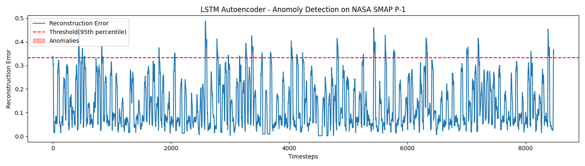

# LSTM Autoencoder for Anomaly Detection

Detecting anomalies in multivariate time series data using an LSTM Autoencoder trained on NASA's SMAP satellite telemetry dataset.

## Overview

The model learns to reconstruct normal time series patterns. When it encounters an anomaly, reconstruction error is high — sequences exceeding the 95th percentile threshold are flagged as anomalies.

## Dataset

[NASA SMAP & MSL Anomaly Detection Dataset](https://github.com/khundman/telemanom)
- Real spacecraft telemetry data from NASA's Soil Moisture Active Passive (SMAP) satellite
- 25 sensor channels with labeled anomalies
- Pre-split train/test sets in `.npy` format

## Architecture
Input (30 timesteps)
↓
Encoder LSTM (hidden size = 32)
↓
Hidden state h — compressed representation
↓
Repeat h × 30
↓
Decoder LSTM — reconstructs sequence
↓
Reconstruction Error (MSE)
↓
Anomaly if error > 95th percentile threshold

## Results

- **8475** test windows evaluated
- **424** anomalies detected (5% of windows)
- Threshold set at 95th percentile of reconstruction error



## Requirements

```bash
pip install torch numpy matplotlib scikit-learn
```

## Usage

```bash
git clone https://github.com/margaretjohn14-alt/lstm-anomaly-detection
cd lstm-anomaly-detection
python lstm_autoencoder.py
```

## Project Structure
├── lstm_autoencoder.py   # main model and training script
├── anomaly_results.png   # output plot
└── README.md

## Key Concepts

- **LSTM Autoencoder** — encoder compresses sequence into hidden state, decoder reconstructs it
- **Sliding windows** — 30-timestep overlapping windows fed to the model
- **Unsupervised detection** — trained only on normal data, no anomaly labels needed during training


git remote add origin https://github.com/margaretjohn14-alt/lstm-anomaly-detection.git
git branch -M main
git push -u origin main